# Lab 7 Web
<hr>
Nama    : Maulana Muhamad <br>

NIM     : 312010188 <br>

Kelas   : TI.20. A.1 <br>
<hr>


# PHP Dasar

Dalam pertemuan ini kita akan mempelajari PHP Dasar dengan beberapa program code PHP nya.

<hr>

### 1). Install XAMPP

install XAMPP kemudian ekstrak file dan sesuaikan lokasi penyimpanannya.
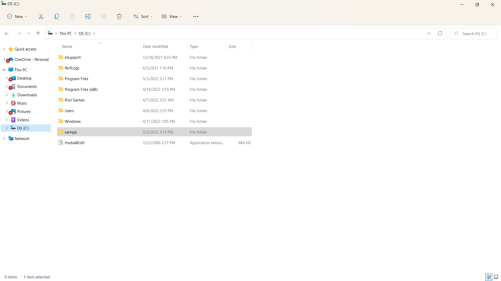

<hr>

### 2). Menjalankan XAMPP

Menjalankan XAMPP dengan cara klik tombol Start pada server Apache seperti di gambar.
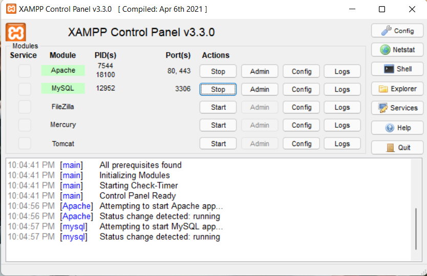

<hr>

### 3). Memulai PHP

Buat folder lab7_php_dasar pada root directory web server (c:xampp/htdocs)

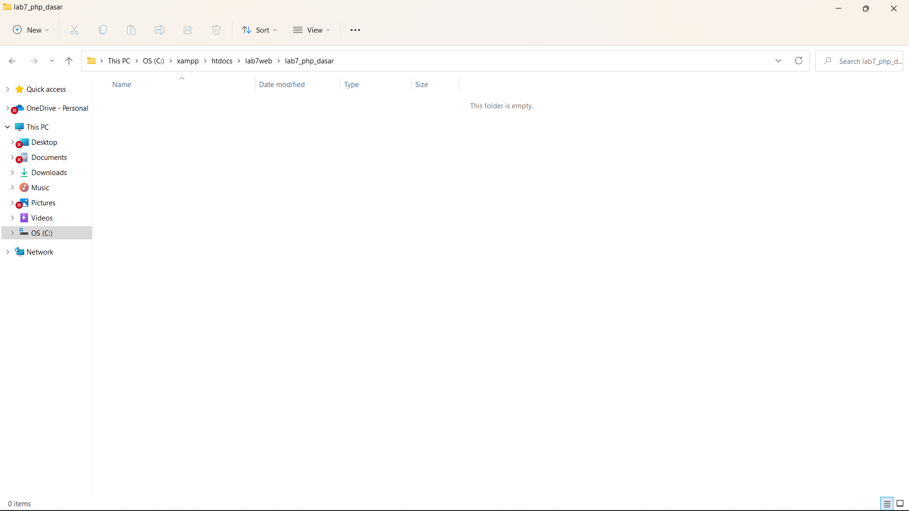

Kemudian akses directory pada web server dengan mengakses URL : http://localhost/lab7web/lab7_php_dasar/

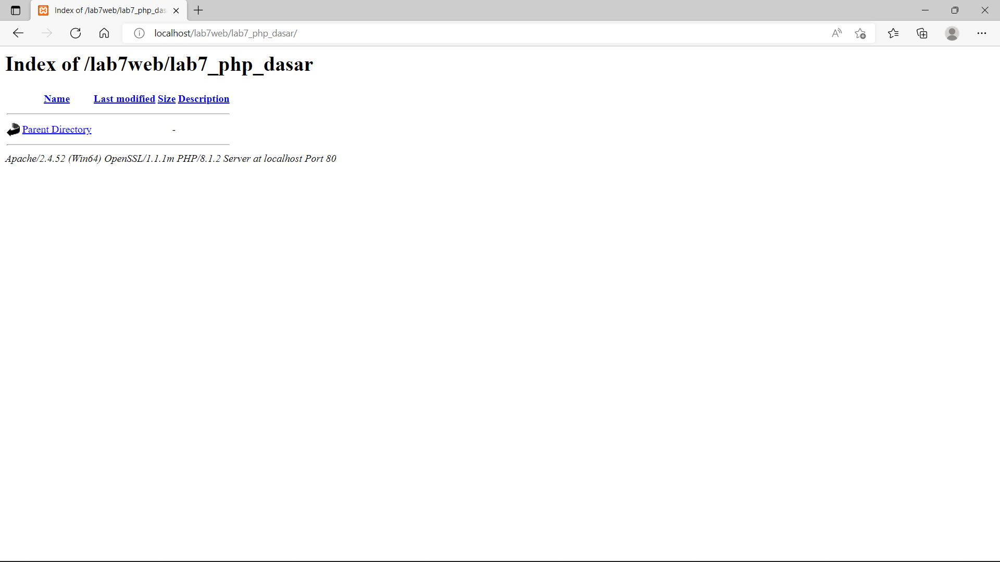

<hr>

### 4).PHP DASAR

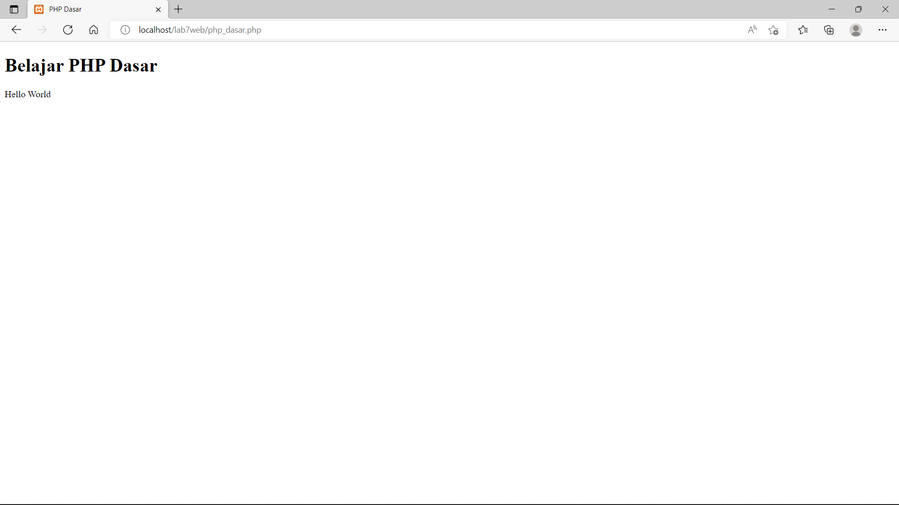

### Dibawah ini Adalah Codingan Dari Gambar Diatas:

```html
<!DOCTYPE html>
<html lang="en">
<head>
    <meta charset="UTF-8">
    <meta http-equiv="X-UA-Compatible" content="IE=edge">
    <meta name="viewport" content="width=device-width, initial-scale=1.0">
    <title>PHP Dasar</title>
</head>
```
```php
<body>
    <h1>Belajar PHP Dasar</h1>
    <?php
        echo "Hello World";
    ?>
```

<hr>

### 5).Variabel PHP
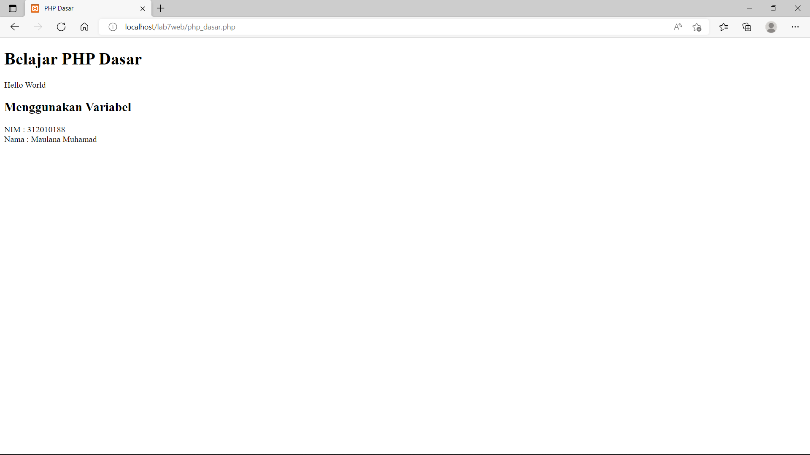

### Dibawah ini Adalah Codingan Dari Gambar Diatas:

```php
 <!-- Variabel PHP -->
    <h2>Menggunakan Variabel</h2>
    <?php
        $nim = "0411500400";
        $nama = 'Abdullah';
        echo "NIM : " . $nim . "<br>";
        echo "Nama : $nama";
    ?>
```

<hr>

### 6).Predefine $_GET
Buat file baru dalam directory lab7_php_dasar dengan nama filenya adalah latihan2.php dan untuk mengaksesnya menggunakan URL : http://localhost/Lab7Web/lab7_php_dasar/latihan2.php?nama=Maulana

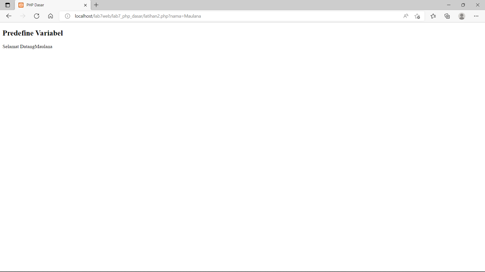

### Dibawah ini Adalah Codingan Dari Gambar Diatas:

```html
<!DOCTYPE html>
<html lang="en">
<head>
    <meta charset="UTF-8">
    <meta http-equiv="X-UA-Compatible" content="IE=edge">
    <meta name="viewport" content="width=device-width, initial-scale=1.0">
    <title>PHP Dasar</title>
</head>
```
```php
<body>
    <!-- Variabel $_GET -->
    <h2>Predefine Variabel</h2>
<?php
    echo 'Selamat Datang'. $_GET['nama'];
?>
</body>
</html>
```

<hr>

### 7).Membuat Form input
Buat File baru dengan nama latihan3.php dalam directory folder lab7_php_dasar

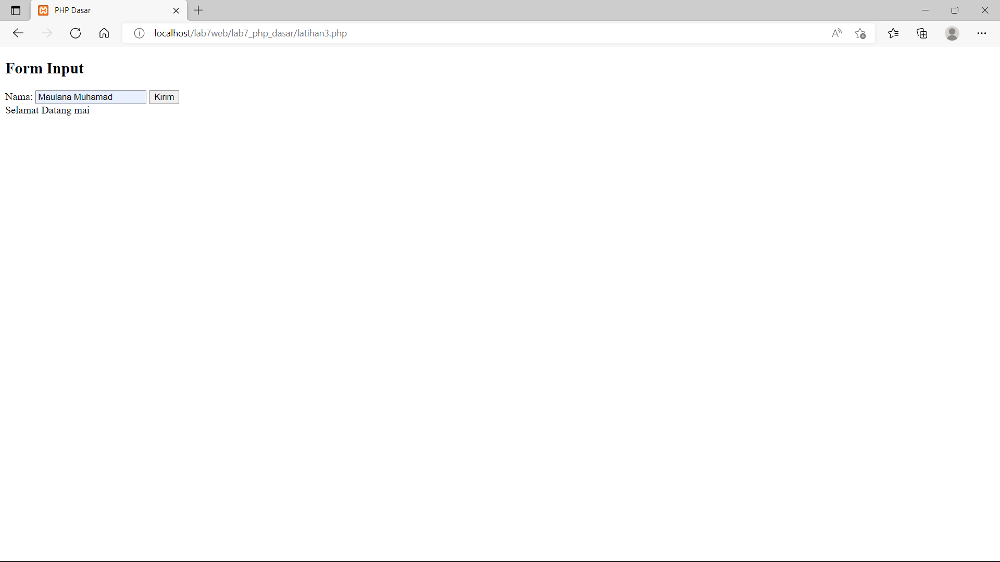

### Dibawah ini Adalah hasil atau tampilan dalam membuat form dalam php dengan variable $_POST:
```html
<!DOCTYPE html>
<html lang="en">
<head>
    <meta charset="UTF-8">
    <title>PHP Dasar</title>
</head>
<body>
<h2>Form Input</h2>
<form method="post">
    <label>Nama: </label>
    <input type="text" name="nama">
    <input type="submit" value="Kirim">
</form>
```
```php
<?php
    echo 'Selamat Datang ' . $_POST['nama'];
?>
</body>
</html>
```

<hr>

### 8).OPERATOR
Membuat OPERATOR dalam php seperti contoh hasil tampilan di atas beserta code nya.
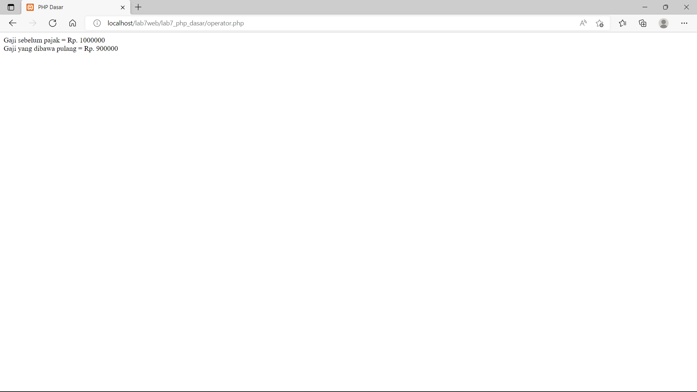

### Dibawah ini Adalah Codingan Dari Gambar Diatas:

```html
<!DOCTYPE html>
<html lang="en">
<head>
    <meta charset="UTF-8">
    <meta http-equiv="X-UA-Compatible" content="IE=edge">
    <meta name="viewport" content="width=device-width, initial-scale=1.0">
    <title>PHP Dasar</title>
</head>
```
```php
<body>
<?php
    $gaji = 1000000;
    $pajak = 0.1;
    $thp = $gaji - ($gaji*$pajak);
        echo "Gaji sebelum pajak = Rp. $gaji <br>";
        echo "Gaji yang dibawa pulang = Rp. $thp";
?>
</body>
</html>
```

<hr>

### 9).Kondisi If
Pengondisian IF ELSE seperti hasil tampilan dan code digambar atas.
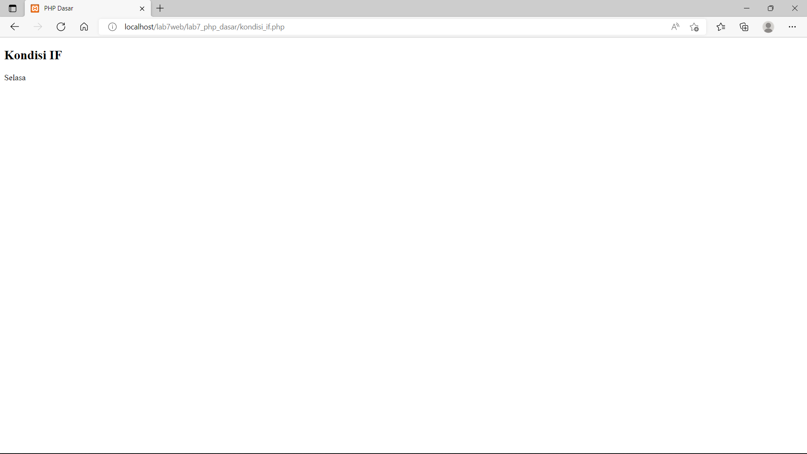

### Dibawah ini Adalah Codingan Dari Gambar Diatas:
```html
<!DOCTYPE html>
<html lang="en">
<head>
    <meta charset="UTF-8">
    <meta http-equiv="X-UA-Compatible" content="IE=edge">
    <meta name="viewport" content="width=device-width, initial-scale=1.0">
    <title>PHP Dasar</title>
</head>
```
```php
<body>
    <h2>Kondisi IF</h2>
<?php
    $nama_hari = date("l");
        if ($nama_hari == "Sunday") {
            echo "Minggu";
        } elseif ($nama_hari == "Monday") {
            echo "Senin";
        } else {
            echo "Selasa";
        }
?>
</body>
</html>
```

<hr>

### 10).Kondisi switch
Contoh penggunaan pengondisian SWICTH CASE dengan Break seperti contoh hasil diatas beserta code.
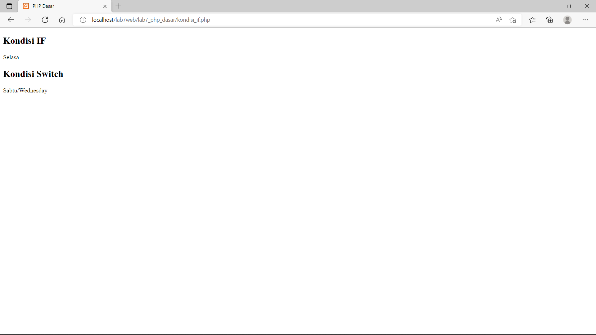

### Dibawah ini Adalah Codingan Dari Gambar Diatas:
```php
 <h2>Kondisi Switch</h2>
<?php
    $nama_hari = date("l");
    switch ($nama_hari) {
        case "Sunday":
            echo "Minggu";
            break;
        case "Monday":
            echo "Senin";
            break;
        case "Tuesday":
            echo "Selasa";
            break;
        default:
            echo "Sabtu";
    }
    echo"/$nama_hari";
?>
```

<hr>

### 11).Perulangan For
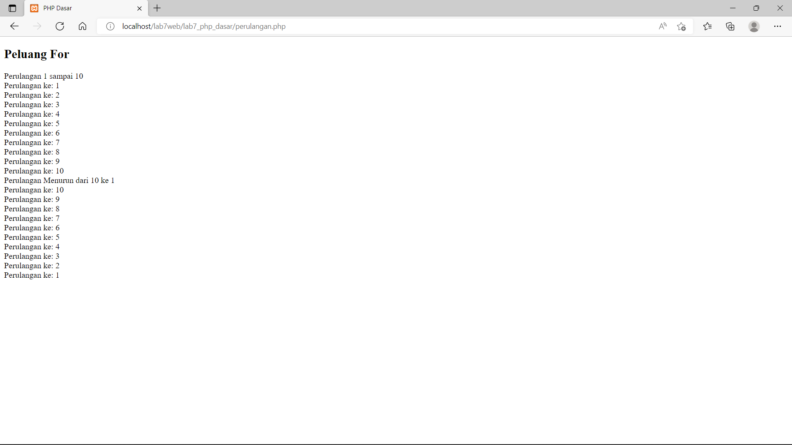

### Dibawah ini Adalah Codingan Dari Gambar Diatas:
```php
<!DOCTYPE html>
<html lang="en">
<head>
    <meta charset="UTF-8">
    <meta http-equiv="X-UA-Compatible" content="IE=edge">
    <meta name="viewport" content="width=device-width, initial-scale=1.0">
    <title>PHP Dasar</title>
</head>
<body>
    <h2>Peluang For</h2>
    <?php
echo "Perulangan 1 sampai 10 <br />";
for ($i=1; $i<=10; $i++) {
echo "Perulangan ke: " . $i . '<br />';
}
echo "Perulangan Menurun dari 10 ke 1 <br />";
for ($i=10; $i>=1; $i--) {
echo "Perulangan ke: " . $i . '<br />';
}
?>
</body>
</html>
```
<hr>

### Perulangan while
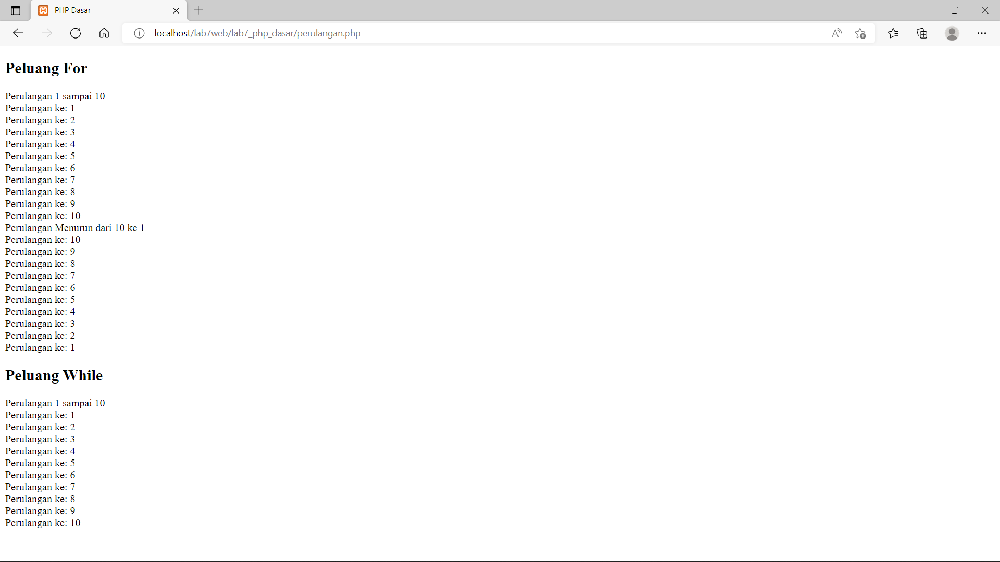

<hr>

### Dibawah ini Adalah Codingan Dari Gambar Diatas:
```php
<?php
echo "Perulangan 1 sampai 10 <br />";
$i=1;
while ($i<=10) {
echo "Perulangan ke: " . $i . '<br />';
$i++;
}
?>
```

<hr>

### Perulangan dowhile
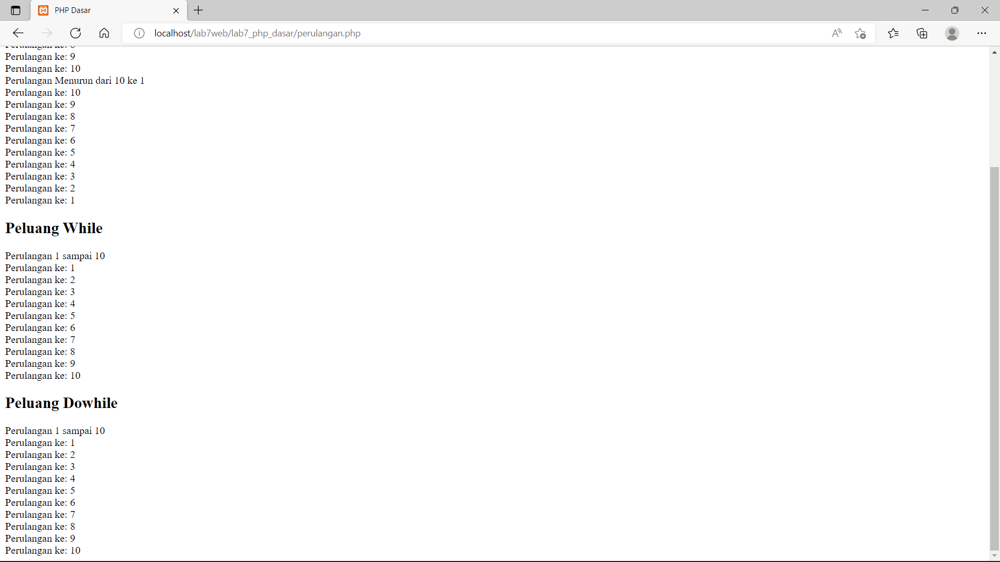

### Dibawah ini Adalah Codingan Dari Gambar Diatas:
```php
<?php
echo "Perulangan 1 sampai 10 <br />";
$i=1;
do {
echo "Perulangan ke: " . $i . '<br />';
$i++;
} while ($i<=10);
?>
```

<hr>

